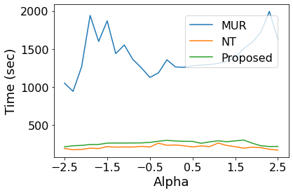
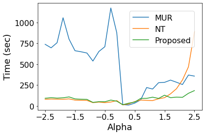

# alpha-nmf

C Implementation of "[A damped Newton algorithm for nonnegative matrix factorization based on alpha-divergence][1]"

Abstract
--------

A novel Newton-type algorithm for nonnegative matrix factorization based on α-divergence is proposed in this paper. The proposed algorithm is a cyclic coordinate descent algorithm that decreases the objective function value along one coordinate direction at a time by using a damped Newton method for monotone equations. It is proved that the proposed algorithm has the global convergence property in the sense of Zangwill. It is also shown experimentally that the proposed algorithm is fast, independent of the value of α while conventional algorithms become very slow for some values of α. 

Main Results
------------

The results of numerical experiments indicate that the proposed algorithm is not always the fastest but shows good performance for all values of α on two different kinds of datasets.

- [ORL dataset][3]

<p align="center">
  
</p>

- [CLUTO (tr23) dataset][4]

<p align="center">
  
</p>


Install LAPACKE/CBLAS
---------------------

[LAPACKE/CBLAS][2] is used in this repository. 

### Download 

URL: https://github.com/Reference-LAPACK/lapack/archive/v3.9.0.tar.gz

### Install

- Mac

```bash
#!/bin/bash

# Bulid
cp make.inc.example make.inc
make blaslib
make lapacklib
make cblaslib
make lapackelib

# Copy the four static library files to "/usr/local/lib"
sudo cp ./librefblas.a /usr/local/lib/libblas.a
sudo cp ./liblapack.a /usr/local/lib/liblapack.a
sudo cp ./libcblas.a /usr/local/lib/libcblas.a
sudo cp ./liblapacke.a /usr/local/lib/liblapacke.a

# Copy the include files to "/usr/local/include"
sudo cp ./CBLAS/include/cblas*.h /usr/local/include/
sudo cp ./LAPACKE/include/lapacke*.h /usr/local/include/
```

- Ubuntu

```bash
#!/bin/bash

# Bulid
cp make.inc.example make.inc
make blaslib
make lapacklib
make cblaslib
make lapackelib

# Copy the four static library files to "/usr/lib"
sudo cp ./librefblas.a /usr/lib/libblas.a
sudo cp ./liblapack.a /usr/lib/liblapack.a
sudo cp ./libcblas.a /usr/lib/libcblas.a
sudo cp ./liblapacke.a /usr/lib/liblapacke.a

# Copy the include files to "usr/include"
sudo cp ./CBLAS/include/cblas*.h /usr/include/
sudo cp ./LAPACKE/include/lapacke*.h /usr/include/
```

[1]: https://ieeexplore.ieee.org/document/9010306
[2]: http://www.netlib.org/lapack/lapacke.html
[3]: http://www.cl.cam.ac.uk/research/dtg/attarchive/facedatabase.html
[4]: http://glaros.dtc.umn.edu/gkhome/cluto/cluto/overview/
